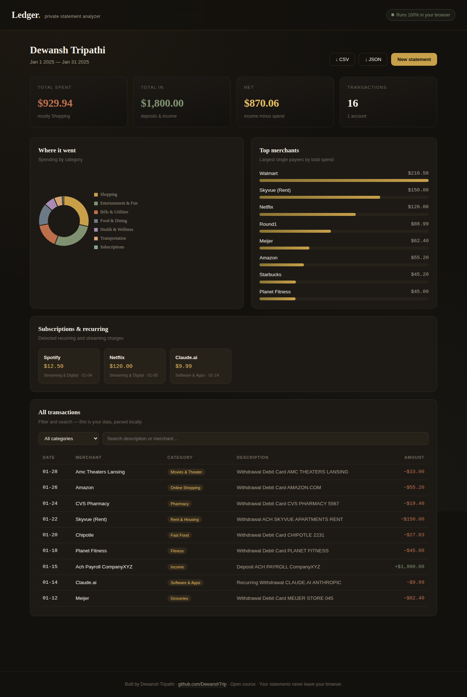

# Ledger — Private Bank Statement Analyzer

A single-page web app that parses bank statement PDFs, categorizes every transaction, and visualizes spending — **entirely in the browser**. No server, no upload, no API calls. Your financial data never leaves your device.

**Live demo:** _add your deployed URL here (GitHub Pages / Netlify / Vercel)_



## Why it's built this way

Bank statements are about as sensitive as personal data gets. Most "statement analyzer" tools ask you to upload a PDF to their server, which means trusting an unknown third party with your full transaction history. Ledger takes the opposite approach: the PDF is read, parsed, and analyzed locally using JavaScript compiled to run in the browser. Open your network tab while you use it — there are zero outbound requests carrying your data.

This was the core engineering constraint, and it shaped every decision: PDF parsing (PDF.js) and charting (Chart.js) are both vendored and inlined, so the entire app is one self-contained HTML file that works fully offline.

## Features

- **Client-side PDF parsing** — extracts text and reconstructs transaction rows by position, no backend
- **Rule-based categorization engine** — 9 categories, 40+ subcategories, keyword-scored matching plus a known-merchant lookup table
- **Spending dashboard** — category breakdown, top merchants, income vs. expenses, net
- **Subscription detection** — flags recurring and streaming charges automatically
- **Searchable, filterable transaction table**
- **CSV / JSON export**

## Tech

- Vanilla JavaScript (no framework), single HTML file
- [PDF.js](https://mozilla.github.io/pdf.js/) for in-browser PDF text extraction (worker inlined as a Blob)
- [Chart.js](https://www.chartjs.org/) for visualizations
- Categorization logic originally prototyped as a Python desktop app, then ported to JS for the web

## Running it

It's one file. Open `index.html` in any modern browser, or serve the folder:

```bash
python3 -m http.server 8000
# then open http://localhost:8000
```

## Deploying

Because it's static and self-contained, hosting is free:

- **GitHub Pages:** push the repo, enable Pages on the `main` branch root
- **Netlify / Vercel:** drag the folder into the dashboard, or connect the repo
- Any static host works — there's no build step

## Notes & limitations

- The PDF parser is tuned for **MSUFCU** statement layouts. Other banks use different formats; the parser's regexes would need adjusting per bank.
- Categorization is rule-based, not ML. It's fast and fully offline, but unusual merchant names may land in "Other / Uncategorized."

## License

MIT
